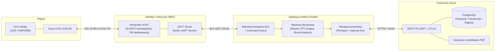
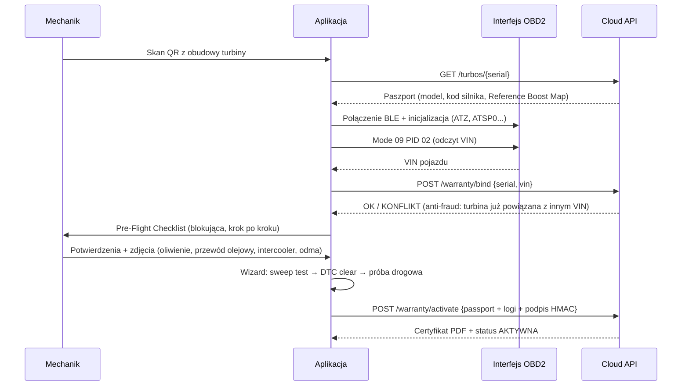

# TurboCare Ecosystem — Architektura Techniczna

> Cyfrowy asystent montażu, adaptacji, diagnostyki i autoryzacji gwarancji
> dla profesjonalnie regenerowanych turbosprężarek.
> **Flutter (iOS / Android) + dedykowany interfejs OBD2 (Bluetooth LE) + Cloud (PostgreSQL).**

---

## 1. Przegląd systemu

TurboCare Ecosystem składa się z czterech współpracujących warstw:



### Filary funkcjonalne

| # | Filar | Moduł w kodzie |
|---|-------|----------------|
| 1 | Cyfrowy Paszport Turbiny + Warranty Interlock | `schemas/turbo_passport.schema.json`, `lib/domain/passport/` |
| 2 | Asystent adaptacji nastawnika (VGT/Wastegate Wizard) | `lib/domain/wizard/turbo_assembly_wizard_controller.dart` |
| 3 | Inteligentny silnik DTC z matrycą przyczyn | `lib/domain/diagnostics/dtc_knowledge_engine.dart` + `assets/knowledge/dtc_knowledge_base.json` |
| 4 | Telemetria live + analizator doładowania | `lib/domain/telemetry/live_boost_analyzer.dart` |
| 5 | Certyfikat cyfrowy + Cloud | REST API + eksport PDF (sekcja 6) |

---

## 2. Architektura aplikacji mobilnej (Clean Architecture)

```
lib/
├── core/                     # Wspólne typy, Result<T>, błędy, logger
├── data/
│   ├── ble/                  # Transport BLE, kolejka komend ELM/UDS, parser ramek
│   └── repositories/         # Implementacje repozytoriów (API, cache, secure storage)
├── domain/
│   ├── passport/             # Model paszportu turbiny, walidacja VIN↔S/N
│   ├── wizard/               # Maszyna stanów montażu i gwarancji (interlock)
│   ├── diagnostics/          # Silnik wiedzy DTC (drzewo przyczyn + checklisty)
│   └── telemetry/            # Analizator boost, health score, detekcja anomalii
└── presentation/             # Ekrany, wykresy (fl_chart), Riverpod providers
```

**Zasady:**

- Warstwa domenowa **nie importuje** Fluttera ani pluginów BLE — czysty Dart,
  w 100% testowalny jednostkowo.
- Komunikacja warstw przez abstrakcje (`ObdTransport`, `PassportRepository`),
  wstrzykiwane przez Riverpod.
- Wszystkie operacje na sprzęcie zwracają `Result<T, ObdFailure>` — brak
  „gołych" wyjątków przecinających warstwy.

---

## 3. Filar 1 — Cyfrowy Paszport i Warranty Interlock

### Przepływ aktywacji gwarancji



### Warranty Interlock — gwarancje twarde

1. **Brak pominięcia kroków** — maszyna stanów (`TurboAssemblyWizardController`)
   dopuszcza wyłącznie przejścia zdefiniowane w macierzy przejść; próba skoku
   przez stan kończy się `StateTransitionError`.
2. **Anti-fraud** — powiązanie `serialNumber ↔ VIN` jest jednokrotne; ponowne
   powiązanie wymaga autoryzacji serwisu (kanał B2B) i zostawia ślad audytowy.
3. **Niepodrabialność raportu** — payload aktywacji jest podpisywany HMAC-SHA256
   kluczem urządzenia zapisanym w Secure Enclave / Android Keystore.
4. **Tryb offline** — checklista i testy działają bez sieci; aktywacja gwarancji
   trafia do kolejki outbox i jest synchronizowana po odzyskaniu łącza
   (idempotencja po `activationId` UUID v7).

---

## 4. Filar 2 — Asystent adaptacji nastawnika (Wizard)

Sekwencja wymuszona przez maszynę stanów:

| Krok | Stan | Test | Kryterium zaliczenia |
|------|------|------|----------------------|
| 0 | `notVerified` | Skan QR + VIN + bind | Paszport zweryfikowany w chmurze |
| 1 | `checklistCompleted` | Pre-Flight Checklist | Wszystkie pozycje obowiązkowe = ✔ (+ zdjęcia) |
| 2 | `actuatorSweepPassed` | **Test I: Sweep VGT** (silnik OFF) | Pełny zakres min→max, brak zacięć: odchyłka pozycji < 3%, czas przejścia w tolerancji marki |
| 3 | — | **Test II: Boost Leak Test** | Spadek ciśnienia/podciśnienia < próg w 30 s |
| 4 | `dtcCleared` | Kasowanie DTC (Mode 04 / UDS 0x14) | Brak aktywnych kodów doładowania po re-skanie |
| 5 | `roadTestValidated` | **Test III + próba drogowa** | Boost Health Score ≥ 85, zero flag under/overboost |
| 6 | `warrantyActivated` | Wysyłka raportu + certyfikat | Potwierdzenie API (lub outbox offline) |

Procedury kalibracji bazowej (Basic Settings / UDS `0x31 RoutineControl`)
są parametryzowane per marka (VAG, BMW, Mercedes, PSA/Ford, Renault) plikami
JSON w `assets/knowledge/procedures/` — aplikacja nie hardkoduje adresów
rutyn, dzięki czemu baza procedur aktualizuje się OTA bez release'u aplikacji.

---

## 5. Filar 3 i 4 — Silnik DTC oraz Live Boost Analyzer

- **DTC Engine** — baza wiedzy w JSON (wersjonowana, OTA), model
  `DtcKnowledgeEntry` z listą `ProbableCause` (waga %, checklista weryfikacji,
  wymagane PID-y live). Silnik sortuje przyczyny malejąco po wadze i buduje
  interaktywną checklistę eliminacji — mechanik musi wykluczyć przyczyny
  zewnętrzne **zanim** zgłosi reklamację turbiny.
- **Live Boost Analyzer** — konsument strumienia próbek PID (10–20 Hz):
  liczy dewiację Target vs Actual, wykrywa okna niedoładowania/przeładowania
  (>0,2 bar przez >1,5 s), klasyfikuje sygnaturę usterki (nieszczelność
  dolotu vs błąd kalibracji nastawnika vs przeciwciśnienie wydechu)
  i wystawia **Boost Health Score 0–100**.

Szczegóły algorytmów — w komentarzach kodu:
`lib/domain/diagnostics/dtc_knowledge_engine.dart`,
`lib/domain/telemetry/live_boost_analyzer.dart`.

---

## 6. Filar 5 — Cloud, certyfikat i model danych

### Stack serwerowy

- **API:** REST (OpenAPI 3.1), JWT krótkotrwałe + refresh, mTLS dla ruchu B2B.
- **Baza:** PostgreSQL 16 — tabele `turbo_units`, `warranty_bindings`,
  `installation_reports`, `road_test_logs` (partycjonowane po miesiącu),
  `dtc_snapshots`; JSONB dla surowych logów, kolumny relacyjne dla kwerend.
- **PDF:** generacja serwerowa (headless Chromium / Typst) z osadzonym
  QR-linkiem weryfikacyjnym i sumą SHA-256 raportu; plik szyfrowany AES-256
  (hasło = token odbiorcy).
- **Retencja:** logi prób drogowych 36 miesięcy (okres gwarancji + zapas).

### Kontrakt danych

Pełny **JSON Schema paszportu turbiny** (dane turbiny, pojazd, checklista,
logi próby drogowej, kody błędów z priorytetami):
[`schemas/turbo_passport.schema.json`](schemas/turbo_passport.schema.json).

---

## 7. Warstwa BLE / OBD2 — decyzje projektowe

- **Profil:** Nordic UART Service (NUS) — `TX Notify` + `RX Write Without Response`;
  MTU negocjowane do 247 B (fallback 23 B z fragmentacją).
- **Protokół:** komendy tekstowe AT/ST (inicjalizacja, wybór protokołu),
  następnie PID Mode 01 oraz UDS (`0x22 ReadDataByIdentifier`,
  `0x2F InputOutputControl` do sweep testu, `0x31 RoutineControl` do kalibracji,
  `0x14 ClearDiagnosticInformation`).
- **Kolejka komend:** ścisła szeregowość request→response (ELM nie obsługuje
  pipeliningu), bufor odpowiedzi do znaku promptu `>`, timeout per klasa
  komendy, priorytety (telemetria wywłaszczana przez komendy krytyczne),
  automatyczny recovery po `BUFFER FULL` / `STOPPED`.
- **Szybka telemetria:** jeden request Mode 01 z wieloma PID (do 6 na ramkę),
  nagłówki ATH0, `ATS0`, `ATAT2` + odpowiedź adaptacyjna — realne 15–22 Hz
  na pętli 4 parametrów przy CAN 500 kbit/s.

Implementacja: [`lib/data/ble/elm_command_queue.dart`](lib/data/ble/elm_command_queue.dart).

---

## 8. Bezpieczeństwo

| Warstwa | Mechanizm |
|---------|-----------|
| BLE | Pairing LE Secure Connections, whitelist po nazwie + challenge FW |
| Aplikacja | Certificate pinning, HMAC payloadów gwarancyjnych, root/jailbreak detection przy aktywacji |
| Pojazd | Komendy zapisu (kasowanie DTC, rutyny UDS) tylko przy zapłonie ON / silnik OFF tam, gdzie wymaga procedura; brak flashowania ECU |
| Cloud | RLS w PostgreSQL per warsztat, audit log append-only |

---

## 9. Struktura tego pakietu

```
turbocare-ecosystem/
├── README.md                          ← ten dokument
├── pubspec.yaml                       ← zależności Flutter/Dart
├── schemas/
│   └── turbo_passport.schema.json     ← JSON Schema paszportu (Filar 1 i 5)
├── assets/knowledge/
│   └── dtc_knowledge_base.json        ← baza wiedzy DTC (Filar 3)
└── lib/
    ├── core/result.dart               ← typy wspólne (Result, Failure)
    ├── domain/
    │   ├── wizard/turbo_assembly_wizard_controller.dart   ← Filar 1+2
    │   ├── diagnostics/dtc_knowledge_engine.dart          ← Filar 3
    │   └── telemetry/live_boost_analyzer.dart             ← Filar 4
    └── data/ble/elm_command_queue.dart                    ← transport BLE
```
